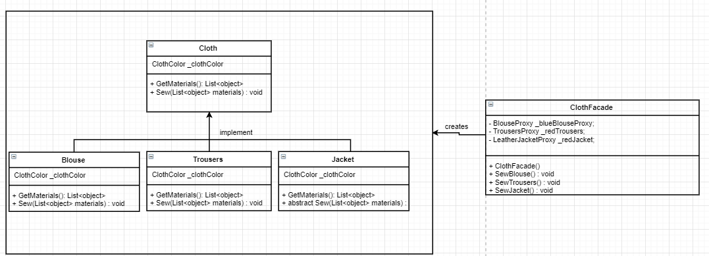
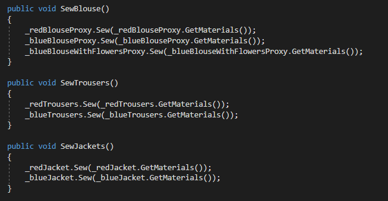
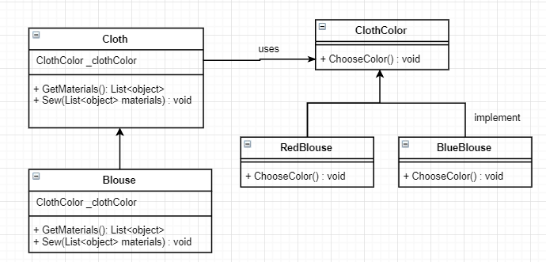
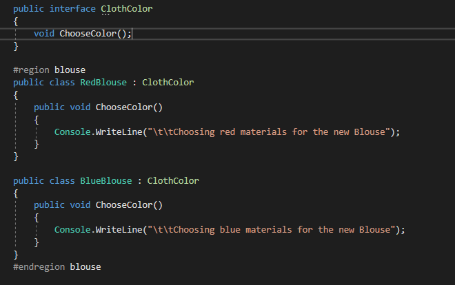
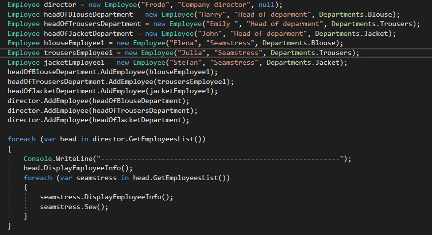
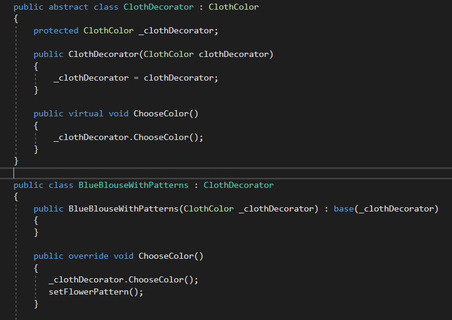
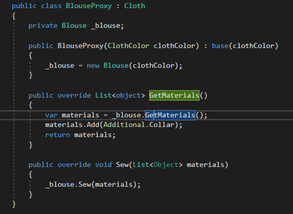

# Laboratory Work nr.2
## Task 
Create a program/app that implements all 5 structural design patterns
## Choosed design patterns
1. _Facade_
2. _Bridge_
3. _Composite_
4. _Decorator_
5. _Proxy_

## Solution 
In my project I have several classes:
1. _ClothesFacade_  - that implements facade design patterns
2. _ColoredClothes_ - implements brdige design pattern
3. _ClothDecorator_ - uses Decorator Pattern
4. _Employee_ -  implments Composite design pattern
5. _BlouseProxy_, _TrousersProxy_, _JacketProxy_  - use Proxy Design Pattern 

## General idea
We have a Clothing Factory that have employees who sew different articles of clothing: blouses, trousers and leather jackets of 
different color.

*__Facade Design Pattern__* - is one of the simpler patterns and the more useful. It hides complexity which cannot be refactored away 
 and provides an interface to the client using which the client can access the system.  
 In my work  I use this pattern as is represented in the diagram below: 
 
 So we have  a clothFacade that is responsible for sewing different items of different colors and as a client we only declare a ClothFacade and
 call the corresponding method, for example: 
 ```c#
  ClothesFacade clothesFacade = new ClothesFacade();
            switch (_departmentName)
            {
                case Departments.Blouse:
                {
                    clothesFacade.SewBlouse();
                    break;
                }
                case Departments.Jacket:
                {
                    clothesFacade.SewJackets();
                    break;
                }
                case Departments.Trousers:
                {
                    clothesFacade.SewTrousers();
                    break;
                }
            }
```
Facade code is responsible for calling  the corresponding methods:
 

*__Bridge Design Pattern__* - is used when we need to decouple an abstraction from its implementation so that the two can vary independently.
If we refer to the idea  of this project, we have different types of clothes and each cloth can have different colors.And as we can see from the diagram illustrated below: I have a ClothColor  that acts as a bridge implementer, so we have decoupled Cloth from clothes colors
    
 In the code it looks so:   
   
  
  *__Composite Design Pattern__* - is used where we need to treat a group of objects in similar way as a single object. It describes a group of objects that is treated the same way as a single instance of the same type of object.  
As I mentioned a clothingFactory have employees : Director, Head of departments and workers: here we have a hierarchy : director who have as subordinates: heads of departments and each head of department has as subordinates: simple workers.
```c#
    public class Employee 
    {
        private string _name;
        private string _position;
        private Departments? _departmentName;
        private List<Employee> _employees;

        public Employee(string name, string position, Departments? departmentName)
        {
            _name = name;
            _position = position;
            _departmentName = departmentName;
            _employees = new List<Employee>();
        }

        public void DisplayEmployeeInfo()
        {
            string info = "[Employee: (";
            info += _departmentName == null ? "" : "Department name: " + _departmentName + "; ";
            Console.WriteLine(info + "Position: " + _position + "; Name: " + _name + ")]");
        }

        public void AddEmployee(Employee newEmployee)
        {
            _employees.Add(newEmployee);
        }

        public void RemoveEmployee(Employee employee)
        {
            _employees.Remove(employee);
        }

        public List<Employee> GetEmployeesList()
        {
            return _employees;
        }

        public void Sew()
        {
            ClothesFacade clothesFacade = new ClothesFacade();
            switch (_departmentName)
            {
                case Departments.Blouse:
                {
                    clothesFacade.SewBlouse();
                    break;
                }
                case Departments.Jacket:
                {
                    clothesFacade.SewJackets();
                    break;
                }
                case Departments.Trousers:
                {
                    clothesFacade.SewTrousers();
                    break;
                }
            }
        }
    }
```
   

*__Decorator Design Pattern__* - allows a user to add new functionality to an existing object without altering its structure.
So untill this step we have employees, different colored clothing items, but what we will do if we need to add something new to those items, for example a pattern. 
In the screenshot below is shown how we add a new pattern to existing cloth item: 
    
  
*__ProxyDesign Pattern__* - a class represents functionality of another class. Proxies are also called surrogates, handles, and wrappers. 
In the example below I make a proxy for Blouse class, so when we create a blouse we use this proxy and it adds a new clothing accesory to the existing blouse    

  


 


