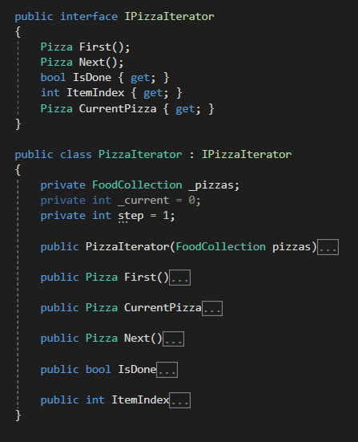
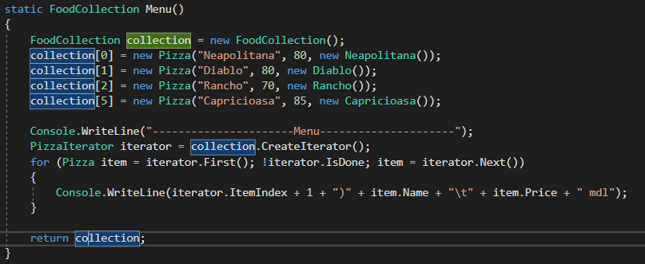
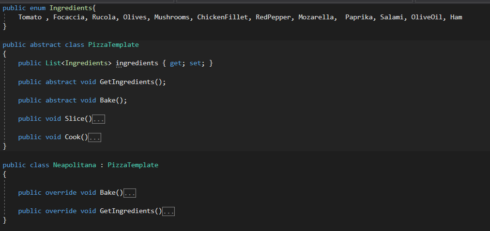
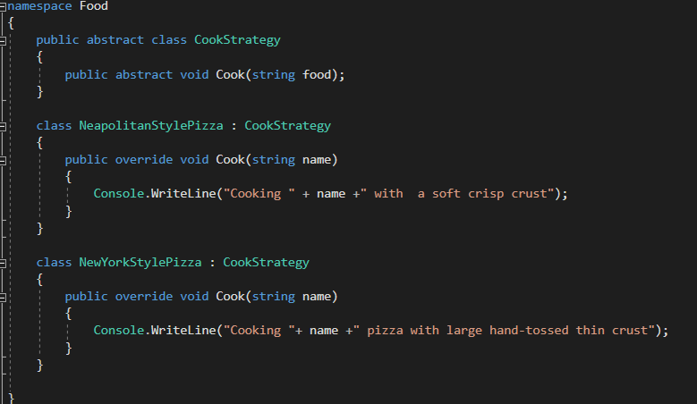
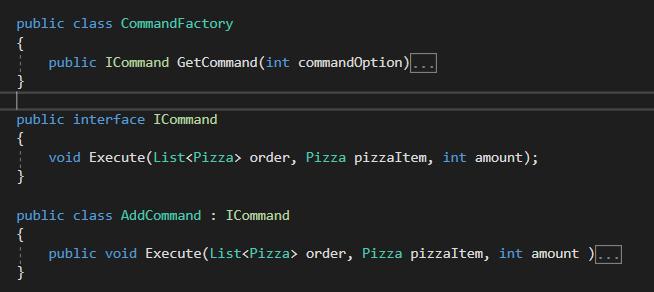
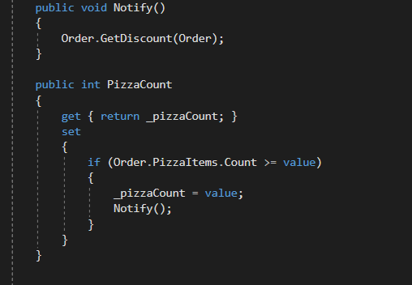

# Laboratory Work nr.3
## Task 
Create a program/app that implements all 5 behavioral design patterns

## Choosed design patterns
1. _Command_
2. _Iterator_
3. _Observer_
4. _Strategy_
5. _Template method_

## Solution 
In my project I have several classes:
1. _PizzaTemplate_  - that implements template method
2. _Menu_ - implements iterator design pattern
3. _CookStrategy_ - uses Strategy Pattern
4. _Command_ -  implments Command design pattern
5. _Client_- use Observer Design Pattern 

## General idea
We have a client who make an order of different types of Pizza that can be cooked using different strategies and if he command more than 5 pizzas then he get a discount of 5%

*__Iterator Design Pattern__* - provides a way to access objects in an underlying representation without exposing access to the representation itself.In our example  we have foodCollection  and pizzaIterator and in order to print the menu we create a food collection that consist of all types of pizza that can be cooked in our restaurant, then using iterator we print the menu on the screen  

   
 

*__Template Method Pattern__* - defines the outline or skeleton of an operation, but leaves the specific steps involved to be defined by subclasses.
If we refer to the idea  of this project, the pizza is cooked according to those steps: GetIngredients(), Bake(), Slice() , since the slice procedure is thesame for all types of pizza we don't define it as an abstract method  and provide an implementation in the base class, for baking and ingredients choosing we use abstract methods and provide implementation in the child classes that inherits from the previous one. 
    
 
  *__Strategy Design Pattern__* - a class behavior or its algorithm can be changed at run time. This type of design pattern comes under behavior pattern. 
As I mentioned the pizza is cooked using different strategies according to the client preference. FOr example we have NeapolitanaStylePizza and NewYorkStylePizza 
```csharp
 pizza.Amount = amount;
 pizza.Price = pizza.Amount * pizza.Price;
 pizza.CookStrategy = new NeapolitanStylePizza();
```
    
  *__Command Design Pattern__* - in my project I have a AddCommandClass that implements an common ICommand interface. It adds pizzas to the client order
  and below is represented how it looks like: 
     
    
   *__ObserverDesignPatter__*-  is used when there is one-to-many relationship between objects such as if one object is modified, its depenedent objects are to be notified automatically.
   In my case I use observer pattern to notify the user that he get a discount of 5%, because he's command includes more than 4 pizzas.
        


  
